# Personal Logs

### Description

## June

### June 15 - June 30

#### First ideas - Really Thinking about what I want to build

When I first got off into the summer break, I had mainly one thing in mind. I knew I wanted to make something that critically examines the role of tactility in the tangibility of a system. I'd been interested in the subject for the past two years and I'd been reading up a lot of material over the third semester (Quick Shout out to Mark Weiser's original [Ubiquitous Computing essay](http://scihi.org/mark-weiser-ubiquituous-computing/), still one of my dearest!). And I also knew I wanted to make something really really cool. In my head, the perfect amalgamation of both these objectives was Iron Man. Robert Downey Jr. muttering to himself as he swishes his hands here and there in a room filled with holograms was ESSENTIALLY cool. And so, I started from there.   
   
 Robert Downey Jr in Iron Man building his suit 

#### 3D Modelling - Setting the scope

Knowing I wanted to create something of the sort, I watched Robert Downey Jr.'s Iron Man - the whole film, and then the [suit building scene](https://www.youtube.com/watch?v=WNu6fRo_7fg) from Iron Man 2 again and again. It proved to be the perfect way to inspire myself while technically also counting as downtime having just finished the third semester of the MSc. And therein lay my first idea for the thesis - Iron Man was building suits, I could build anything. Having used CAD as an industrial designer for close to 5 years by this point and then new modelling environments such as [Unreal](https://www.unrealengine.com/en-US) and [Blender](https://www.blender.org/) while on the MSc., I was all too familiar with the complaints around it. Navigating a 3D environment in 2D is unnecessarily hard. Sure, I've gotten used to it now, over time, but I've never really enjoyed it. A few too many times in the past as I try to make an edit here or a delete there, I've gone wrong - not because I didn't know how to use the tools but because, I believe, the tools weren't really designed well. "If I could model anything I wanted just like Tony Stark does with his hands, the whole process would be so much easier. Because it would be a lot more tangible! And more fun too! "     

 I always really disliked these kinds of tools 

#### What does it mean for something to be tangible? And tactile?

Before the school was officially on break for the summer, I got an opportunity to speak with my supervisor Phoenix and the first thing she asked me to do was define what 'tangibility' and 'tactility'. These were terms I'd been throwing around but never really critically examined. I sat down and came up with these definitions - an extension of dictionary definitions of tangibility (see definition no. 2 [here](https://www.merriam-webster.com/dictionary/tangible)) and tactility ([here](https://www.merriam-webster.com/dictionary/tactility)), based on individual experience:

While traditionally, tangibility is related intrinsically to touch, its definition can be extended to include other sense that one is capable of perceiving. If something is tangible, that means it is comprehensible through some means. Hence, tangibility could be defined as:

> **Tangibility**: The perceptibility of an object.

Tactility, on the other hand, is more grounded in touch. But when Iron Man uses holograms to create his suit, he is not touching any tactile thing at all. He is performing the actions that he would with an otherwise tactile form with results that match expectations of tactile objects. So tactility can be broken down into two definitions:

> **a) Tactility**: The capability of an object to be touched.

But also, for my context:  
> **b) Tactility**: The capability of an object to behave as though being touched - whether through physical touch or through simulated touch like haptic feedback, etc.

## July

### July 01 - July 15

#### Why 3D Sculpting though??

Of course, making a whole tactile computer was too large of a scope for the project so I decided to sit down and think about what computing processes could best be enhanced from the tactility I was imagining. Having spent years as an Industrial Designer and consequently a CAD Modeller, 3D Modelling was an obvious choice. 3D Modelling is difficult, it is not easy to visualise 3 dimensional objects on a computer screen and manipulate them effectively. Moreover, having used Blender and Unreal Engine during my MSc., I had found myself even more frustrated by 3D Sculpting - the process that was meant to replicate real world affordances and make modelling easier. After some critical thought, I came to the conclusion that 3D Sculpting as an intuitive process is a promise unkept by its restriction to the same means of interaction as 3D modelling. While the process is inherently easier to understand, it still suffers from the same cognitive load drawn by using 2D means of representation such as a display and 2D means of interaction such as a computer mouse. It is for this reason that I decided to work on 3D sculpting - to enhance it and complete its promise of a fundamentally intuitive way of CAD.    

 Screenshot of Sculpting in Blender 

#### Has anything like this been done before? - Starting the literature review

The next step was to recognise the efforts that have gone into the field so far. I started by tracing my steps back to the original pieces such as [Mark Weiser's](https://rasmusbroennum.files.wordpress.com/2009/02/ubiquitous-computing-mark-weiser-1993.pdf) and [Ishii and Ulmer's work](https://dl.acm.org/doi/10.1145/258549.258715) that inspired me and did a deep dive into the history of tactility in computing. Following this, I started looking for material on tactility in 3D Modelling. To my astonishment, I discovered upwards of 30 pieces of literature and projects where people had worked towards the same goal, albeit in their own varying ways. I spent most of the fortnight simply collecting documents and reading abstracts to gain a fundamental understanding of the space I was trying to innovate within.

#### Free Form Deformation - How could I actually make something like this?

While looking up the various approaches people have taken to creating such a system, I came across [Free Form Deformation](https://dl.acm.org/doi/10.1145/15886.15903) (FFD for short). FFD is a technique that has been around since at least as far back as 1986. It involves the creation of a hull object around a 3D model much like 2D vector graphics that can be pulled, pushed and rotated in different angles to deform the enclosed 3D Model. While this is not the most intuitive means of modelling, to me it represented an approach that would prove to be the basis of the tool I created for the thesis - the idea that I can move singular points in space in an intuitive manner replicating the kind of interaction used for physical clay modelling in order to manipulate entire objects.  

   
 Free Form Deformation illustrated 

#### I need to turn the scope waaaaaaay down - Landscape Sculpting

The discovery if FFD excited me into my first foray into actually writing code for the project. I decided to download versions of FFD implementation and run them in a variety of environments such as [OpenFrameworks](https://openframeworks.cc/), [Processing](https://processing.org/), and [OpenGL](https://www.opengl.org/). Although I was only slightly successful in this quest, I realised one thing really quickly - 3D forms are very very DIFFICULT. Keeping track of a vast array of 3D vertices is easy, drawing triangles between them dynamically is extremely difficult. Besides, if I were to go down this path, I would simply be reinventing a wheel that had already been fine-tuned over decades by much smarter people. So, I decided to dial down my scope. I began to think of 2D calculations that could lead to 3D representations and the solution of manipulating landscapes only became clear. Landscapes are essentially 1D in nature - They are a collection of points with fixed x and z co-ordinates (width and length) with the only thing changing constantly being the y (height). If I were to create a tool for sculpting landscapes, it would be far easier to calculate the triangles and consequently even end up finishing my thesis.  

 Landscape Sculpting in Unreal Engine 

#### So, it's like clay sculpting. Well then, what is clay sculpting?

Having decided I want to do 3D Sculpting for landscapes, I spent some time trying to think of what makes clay sculpting "clay sculpting". I decided to buy Play-Doh and experiment with modelling my own landscapes physically in pursuit of trying to understand the process and all it entails. While I didn't gather any tangible observations from it during this period (I get into these observations in a later month), it set me up well towards thinking about tactile modelling.

### July 16 - July 31

#### What's wrong with Blender and Unreal? - Where's the disconnect?

But virtual clay modelling is not a new idea! It exists, very much. Programmes like [Unreal Engine](https://www.unrealengine.com/en-US), [Blender](https://www.blender.org/), [Cinema4D](https://www.maxon.net/en/cinema-4d), [ZBrush](https://www.maxon.net/en/zbrush), etc. use virtual clay to model 3D characters and environments. Before I could set off inventing better clay modelling, I decided to understand what was wrong with current clay modelling. This was done through a mix of using these programmes one after the other (except the paid ones) and then switching to physical clay modelling top recognise the gaps in the experience that make them less intuitive. At the end of the process, I came up with the following observations:

- 2D means of visualisation (monitor) and manipulation (mouse and keyboard) are detrimental to the intuitiveness.
- The software are filled with a variety of 'brushes' and tools which is overwhelming.
- A lot of these brushes save the simplest ones have complex behaviours that do not match our expectations from there
- There is no haptic, audio, (or olfactory) feedback like one would expect from physical clay.
- Virtual clay doesn't behave well when very complex deformations are done on it.
- Virtual clay needs to be re-meshed in order to maintain fidelity.
- Being unable to visualise things at scale in 3D dimensions is detrimental to the cause

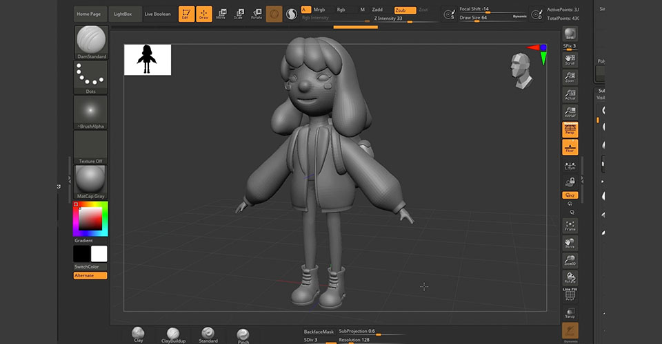
 Creating a character in Cinema4D 

#### First trials with Kinect - This is impossible!!!

In order to solve for these gaps, I identified the need to build a new input system for these applications that relies on physical means of interactions and can provide feedback beyond mere visual one. I thought of using the Kinect 2, which I had previously attempted at harnessing in Semester 2. The idea was to let the Kinect's blob detection and limb detection determine the shape and location of my hands and to then 'insert them' into the Blender to manipulate objects. I decided to check out a Kinect from the CCI and started experimenting with it but the more I experimented the clearer it became why the Kinect isn't used as heavily as its marketing pitch would make one believe it could be:

1. **Not Supported**: First, the Kinect 2 which is the most open easy-to-use Kinect is not supported regularly by Microsoft. Having been replaced by Azure Kinect officially and the hardware discontinued, the support for troubleshooting is limited. Most forums for the Kinect are dated and most code is made by third party enthusiasts meaning the gaps left in it that need to be addresses in order to use it are immense.
2. **Hard to Integrate**: Input data from the Kinect can be visualised easily using the SDKs Microsoft provides (albeit with a complicated installation process personally speaking), but those values are hard to bring over into code that can be written into other third-party software. For example, I tried using Java ion Processing and Python in Blender (with libraries people had built for each) but only ended up getting 2D visualisations of the depth camera after a lot of programming. I couldn't find any way to get the Kinect to detect blobs and pass blob locations directly, meaning a lot of effort would have to go into reconstructing the existing blob detection specifically for my software.
3. **No Support Beyond Basic Hands and Legs**: While Hands and legs can be easily recognised, tools that one needs to hold in their hands to sculpt are a different story.   
   
    
 The Microsoft Kinect     
        

#### Do I need to rely only on hands? - 'How Things Shape the Mind: A Theory of Material'

Another conflict I was trying to figure out was - Does it have to be just hands? Using one's hands to manipulate virtual clay would make it the most intuitive means possible since the cognitive load would be the least. But sculpting also sometimes necessitates the use of specific tools for the sort of precision one's fingers cannot offer. I could not decide whether I want to restrict my software to only be able to manipulate using hands or integrate sculpting tools in the software when Phoenix pointed me to an excellent book that settled this conflict. Lamfouris' [How Things Shape the Mind: A Theory of Material](https://mitpress.mit.edu/9780262528924/how-things-shape-the-mind/#:~:text=How%20Things%20Shape%20the%20Mind%3A%20A%20Theory%20of%20Material%20Engagement,human%20thinking%20and%20cognition%20more) speaks of how tools become essentially an extension of one's hands - that using these over time makes them as though they're a part of us, that we learn to think through tools and their affordances. It is at this point that I decided that it was okay to replicate tools as well as they wouldn't compromise on the intuitiveness I was going for.

## August

### August 01 - August 15

#### Continued trials with Kinect - Still Impossible!!

I continued work on the Kinect employing various strategies involving the integration of Kinect data into Unity, Unreal, [Arduino IDE](https://www.arduino.cc/), and the previously used OpenFrameworks and Processing. Dan Schiffman's excellent Processing for Kinect [videos](https://www.youtube.com/watch?v=QmVNgdapJJM) and [library](https://github.com/shiffman/OpenKinect-for-Processing) provided me with a lot of help but it was still passing random values every now and then and completely failing to connect with my PC at other times. For the sake, I decided to give up on the development for the time being and focus instead on studying more literature where I could find possible answers. 
>"It is still early August, Advait, it'll happen don't you worry."

#### Basic Mechanism

While the Kinect wasn't really working, I was still focussing on the design model I want to achieve. For this, I decided to sit down and create what felt the most, incidentally, intuitive to me. For the purpose, I would need to know where the hands of the sculptor are at all times along with details such as orientation, pose, movement delta, etc. (which I would get through the Kinect presumably), a mesh filled with individual vertices that would be able to inherit movement from the hand, and a method to assign triangles to the vertices repeatedly. I called this system 'Free Form Vertice Displacement' as an ode to the FFD that inspired me. The first rough sketches looked as follows:  

#### Looking at more projects and literature - Categorising?

As I looked deeper and deeper into the literature surrounding tactile modelling systems, I started categorising the projects I'd found internally. There were, of course, the purely theoretical papers that focussed on what it means for something to be tactile and how it could impact interaction. There were projects that used Head Mounted Displays like in VR to visualise 3D Models along with basic manipulation such as scaling and positioning. There were still more complex works that integrated the earlier mentioned FFD, but their modelling techniques seemed alien to me and the antithesis of this research. There were systems that let user model in physical space and simply translated the created models to the virtual. These seemed fascinating and paper results indicated that users found it easier to model overall but the glaring issue that stood out was their feasibility in workspaces. For example, one project hypothesized a sand sculpting tray. Users could sculpt landscapes (just as in my proposed project) with the help of their hands in actual sand and then a Kinect was used to translate this data as a depth image and convert it into a matching (albeit poorly constructed) 3D Model. I took away a lot of learnings from each category I found - some more intuitive but less feasible, some more feasible but less intuitive, and some neither. There was an obvious gap that coincided with my research interest - how do you build something that is both?

#### There's a whole taxonomy paper in here! - Literature Review

With my development not quite going as planned and tonnes of ideas flowing my way in the literature review, I sniffed out an opportunity - I could write a taxonomy paper! There were definitely visible categories amongst the works I'd read about, and each category was distinct from the next. Some retained the 'trueness of tactility' as in the sandpit project. Some were more feasible but less intuitive, although chasing the same general direction of tactility, while very few achieved both but at the cost of performance. I decided to make a first draft of how I would categorise these systems and along what metrics. I decided to name the categories and after a number of names that I didn't quite like, such as 'Purely Tactile', 'Simulated Tactile', and 'Extended Tactile' systems, I settled on the following three:

- Truly Tactile
- Hybrid tactile
- Pseudo Tactile

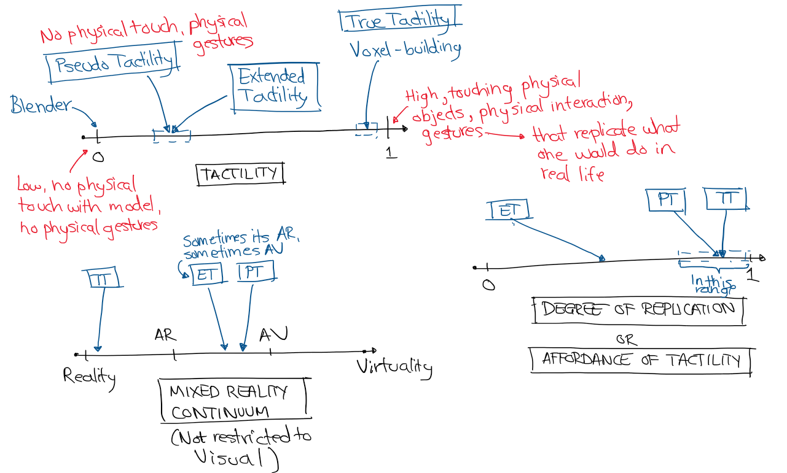
 First sketch of Taxonomy 

> This is the quick first version of the taxonomy. The finished version can be found in the paper under the literature review section (towards the end):

### August 16 - August 31

#### Something with this is off! - It needs to be visualised in 3D as well

As I was doing my experimentation in developing with the Kinect and various frameworks while trying to align my philosophy with my literature review, something kept feeling off about the method i'd chosen to address the gap. I decided to clear my head after an entire week of shacking up in my room developing mesh frameworks to go out in the world and try to find a third person perspective on the project. As I walked through Lucas Gardens for one last time (I was moving houses soon), an epiphany hit me: "If I'm developing something that tries to replicate the real world in response to traditional 2D interactions of CAD, why am I keeping the visualisation 2D?"
I realised I was trying to solve only half the problem I had already recognised. Sure, the Kinect would help transition my interaction with 3D Sculpting software into 3D from 2D, but I was still deeply tied to the idea of a 2D Screen. Not deliberately, not by design, but because I hadn't considered the alternative. I decided to stop all work immediately and instead focus only on developing my internal 'Why's and then restart the 'How's. The timing, too, was all too convenient given my imminent move of houses.   

#### More literature review - Actually Writing It

I spent the rest of the fortnight pretty much entirely occupied in the move to a new environment and had little time to utilise to work. Whatever time I had, I fell back into Literature Review and the formulisation of my argument. It is in this period that I wrote a major chunk of the actual Lit Review for the paper which 80% remains unchanged to the final submission.

## September

### September 01 - September 10

#### Chat with Lieven - Let's put some VR in here, that should do it!

In the first week of September, I had a very helpful chat with Lieven Van Velthoven to decide the way forward for the project and to sound off a few ideas I'd had floating around in my head since last month's epiphany. After sharing a brief laugh about the stupidity, I was about to embark on w.r.t. writing blob detection for the Kinect to just recognise one's hands, we arrived upon a solution that he was confident would work for me (Spoilers: Thanks Lieven, it did) - Using a VR headset with Unity Engine to develop my tool.  
A VR headset would ensure the user had the capability to visualise the model they were working on in 3D real-time. It could be a mix of AR and VR according to user preference, but it would make navigating one's landscape seamless and present it at scale to aid visualisation.  
Using Unity Engine, as Lieven pointed out, would give me a prebuilt base to create 3D Computer Graphics code, the kind I needed to pull this off. His suggestion for using Unity Engine over other engines came down to two main reasons:

- Unity had in-built support for 3D Graphics and XR Interaction. This would cut down on the complexity and the resultant time I would need for developing.
- Unity, having been around for years, had a loyal community and community-built tools and plugins alongside extensive forums to help address any obstacle I hit.   

    
 Visualisation would be a whole lot better in VR

#### Unity is the solution! - But everyone suddenly hates it??

In order to make the best possible decision for a 3D engine, I decided to play devil's advocate. I borrowed a VR headset from a friend and tried integrating it into multiple engines, looking up tutorials and gathering a background of what it would take for me to pull this off. I eventually decided on using Unity as the following glaring arguments came up against the other Engines:

- Unreal had great rendering capabilities but limited support on online forums and communities for XR Development due to the relatively shorter period of time it has been out for.
- OpenFrameworks suffered from similar lesser degree of online support, but in addition, would also need far more optimisation on my part to ensure performance.
- Processing, although having more resources online for the purpose, wasn't as capable at being a 3D Engine in itself.

Funnily enough, as I was making the decision to choose Unity as my preferred 3D Engine to develop with, Unity announced its new **evil** [monetisation strategy](https://www.pcworld.com/article/2069121/unity-has-done-the-impossible-united-gamers-and-developers-against-it.html). Within the space of a week perfectly coinciding with me starting to love Unity, everyone online started hating it. It didn't matter as much to me, given thew scope of my project, but the timing gave me a good chuckle. We'll see if I do end up using Unity after this project for any purpose. My _money_ is on 'not'.

### September 11 - September 20

#### Time I started developing! - Making the VR Rig in Unity

The first step in development was a sanity check. Does making Unity VR actually work (of course it does). I started off by making the VR Controller. The VR Controller is a series of scripts and Unity Game Objects that allow for a user to take control of a player character, view, and move around the virtual world. It contains components such as the VR Camera, player body, player hands, animations for them, and the control scheme. Massive thanks to [Valem Tutorials](https://www.youtube.com/@ValemTutorials) on YouTube and their [VR Intro series for Unity](https://www.youtube.com/watch?v=HhtTtvBF5bI&list=PLpEoiloH-4eP-OKItF8XNJ8y8e1asOJud) - it helped me create the player controller perfectly!
Through the tutorial and a few tweaks here and there, I was able to create a player controller and camera that was able to look around, rotate and move in VR Space using the [OVR (Oculus Virtual Reality) Toolkit](https://developer.oculus.com/documentation/?locale=en_GB) for Unity.

#### I bought the Meta Quest 2

When it was clear that this was going to work, I decided to purchase a Meta Quest 2 myself in order to reliably continue development without having to keep up with the borowee's timelines. I explored a bunch of VR headsets before making my decision including the [Oculus Rift](https://www.oculus.com/rift-s/?locale=en_GB), [Valve Index](https://store.steampowered.com/valveindex), [HTC Vive Pro 2](https://www.vive.com/uk/product/vive-pro2/overview/), [Pico 4](https://www.picoxr.com/uk/products/pico4?utm_source=Search&utm_channel=Google&utm_campaign=brand&gclid=CjwKCAiAjfyqBhAsEiwA-UdzJFviIK638sfgBQYtMj2GiOI9-Xv0Qt-7t2x1dxEf18vFlg39786f0xoCzvkQAvD_BwE), and [Samsung Gear](https://www.samsung.com/uk/support/model/SM-R325NZVABTU/). Ultimately, I chose the Meta Quest 2 for the following reasons:

- I was already using the OVR Toolkit and had tutorials and support for it online in case anything went wrong.
- It came from a reliable name in VR - Oculus (now bought by Meta) and had tons of support available online
- It was rather cheap at 200 pounds (second-hand from CeX)  

Of course, the first thing I tried to do with it was play Skyrim in VR, but that is outside the scope of this documentation hehehe.

 The Meta Quest 2 

#### Thesis Editing - What is my argument really? How am I framing it?

While the Quest was out for delivery, I started looking at my research question again. I'd started off believing that creating this tool would make it more intuitive than regular tools in line with the tactility hypothesis. But having used my friend's VR headset for a bit to explore its capabilities, I realised that intuitiveness might not be the only thing that a VR headset and corporeal interactions could add to the act of 3D Sculpting. There was also:

- **Immersion** - The engagement I felt in the VR world coupled with how immersed I was created an environment of almost no distractions. This could potentially aid any creative process.
- **Creativity** - Creating in a new environment, based on my experience using Gravity Sketch, was so refreshing! I spent many hours sketching and making 3D models in Gravity Sketch on my borrowed Quest and as I reflected on my experience at the end, I was confident I'd been a lot more creative than with pen and paper. (Or felt a lot more creative, at the very least -All I'd really made was three dimensional doodles).
- **Fun!** - I don't know what to say, it was just fun! And if I had that much fun, I saw all the reasons to be compelled to keep doing it.
- **Efficiency** - I'd also felt very efficient making things in Gravity Sketch My hypothesis was, with a little getting used to the new environment, I would be able to create things a lot faster in VR using these physical interactions than on my PC  

I decided to integrate these in my research question, design towards them, and when the time came test against these additional metrics to gather dat.

#### Hand Presence and Physics - OpenXR vs OVR Toolkit

Once my VR Headset was here, I continued developing with the help of tutorials like [this one](https://www.youtube.com/watch?v=VG8hLKyTiJQ) and [this one](https://www.youtube.com/watch?v=gGYtahQjmWQ), but some or the other thing kept going wrong. Either I was able to launch the application successfully but not move, or it would do both but then randomly stop working, or it would work fine but refuse to provide any readings from the controllers I could use in scripts or do all of the above well but all the readings be 1.000. I decided to dig a little deeper in online forums and the underlying code to find out what was wrong. I soon realised the latter was beyond my job description, but the former yielded an answer: Unity had overhauled its entire XR system about 2 years ago and introduced its own XR Interaction Toolkit. (Thanks to [this video](https://www.youtube.com/watch?v=Yjee_e4fICc&t=103s) that finally helped me understand it all) This wiped all the support from community built resources I was relying on, third party tools like OVR, and made most of the tutorials I was looking at redundant, or at the very least confusing. To add to the problem, the XR Interaction Toolkit was sparsely documented online and amongst community tutorials due to its relative recency. It took a little working things around, but eventually I was able to work out one thing w.r.t. to my project: I couldn't use OVR, I had to use [OpenXR](https://www.khronos.org/openxr/).   
> This also additionally brought with it the advantage of not having to change the project up to use it on VR headsets other than Meta Quest 2, and that was definitely a win.

### September 21 - September 31

#### The Mesh Object!

The next step was to find the right framework to integrate my fundamental design into. I didn't have to look too far as I almost immediately found [Unity's native Mesh object](https://docs.unity3d.com/ScriptReference/Mesh.html) which let me define vertices as 3D Vectors with Cartesian locations. If everything went according to plan, I could then simply manipulate these vertices I supply to a mesh object through another class linked to the VR Controller data and achieve my vision. The mesh object required an array of vertices and triangles, along with uvs, normals, colours, etc. optionally. 
> While normals are also a must, Unity's inbuilt [RecalculateNormals()](https://docs.unity3d.com/ScriptReference/Mesh.RecalculateNormals.html) method is reliable enough for the use case and just calling it every frame ensures I don't have to get into the specific mathematics of normals.

 Unity Mesh Object example 

#### Generating a mesh procedurally

In order to generate a mesh, it was impossible to manually code in the number of vertices and triangles I would need. It was also not the 1980s and I figured there had to be a better way to do this. Fortunately for me, I found a few rather easily. With learnings from tutorials such as [this one](https://www.youtube.com/watch?v=-3ekimUWb9I) and [Brackey's](https://www.youtube.com/@Brackeys) very helpful [series](https://www.youtube.com/watch?v=64NblGkAabk&t=374s), I was able to create a 2D mesh plane procedurally.

#### Perlin Noise comes in clutch once again + Vertex Shading in URP

To make the mesh have terrain like qualities, I did two things:

- I used my learnings about Perlin noise from Semester 1 to create 1D Perlin noise for the height of every single vertex. This made the landscape random yet smooth, as Perlin noise does.
- I used [this tutorial](https://www.youtube.com/watch?v=lNyZ9K71Vhc) to create a vertex shader using the Universal Render Pipeline and defined a gradient to plug into a vertex shader. This made sure that every single vertex and its surrounding area on the mesh was shaded according to its height relative to the minimum and maximum height in the mesh's vertices in order to give the illusion of terrain for easy visualisation of the impact sculpting it was creating later on.

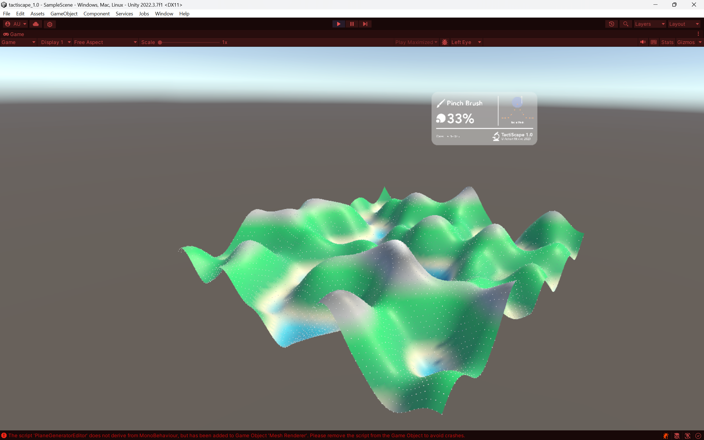
 Perlin Noise generated Mesh     

#### Talking to sculptors - What do they really do?

Then I took another step back and bought myself some clay. I realised as I started really thinking about how I would allow the user to sculpt this mesh, that I had little to no idea how to sculpt anything. I decided to undergo a two-prong approach:    

(a) I began speaking to a few sculptors and digital artists about their process sculpting - I found these through mutual friends and Camberwell College.     
(b) I bought plasticine Play-Doh and downloaded Blender and started creating intricate landscapes in it.

At the end of this process, I'd realised most of the tools I'd need to make and the functionalities that were crucial to effectively combine the advantages of the physical and the virtual - brush impact types, shifting sizes, visualisation techniques and angles, brush shapes, etc.

## October

### October 01 - October 10

#### And what if I want to move around the world myself?

I also could, at this point, instance my player controller at any point in the mesh and look around. But not move. So I added player movement with a simple script as found in [this tutorial](https://www.youtube.com/watch?v=Jvb7sAR2Tmk)

#### Now what if I move my hands just a little bit? - Deforming the mesh little by little

I had a VR Controller able to pick up hand readings, I had a mesh generation script that was able to create beautiful Perlin noise meshes, and together the two allowed me to walk in this nice landscape. Obviously, now I had to figure out how to sculpt it. I looked at a lot of video tutorials like [this one](https://www.youtube.com/watch?v=l_2uGpjBMl4) for example, and little by little, I pieced together the technique I would need to create my sculpting methods:

- Create a separate Mesh Interactor script that inherits values from the VR Controller (Hand location, player location, etc.) and the Mesh Generator (Vertices Location, Triangles, etc.)
- Check if values from the VR controller coincide with any values from the Mesh Generator (for loop to look at all vertices, collision?)
- Translate the vertices away from the hand location.
- Recalculate the triangle locations

> And I had to do it on every frame.

#### SUCCESS! - I CAN DEFORM THE MESH!

And so, I looked back at the design I had envisioned and write a new Mesh Interactor script. This script made a copy of the vertices from the mesh generator script, went through a for loop to look at each one of them, and at every vertex, translate it in the direction radially away from my right hand. The first prototype lacked any refinement and had a few problems:

1. The vertices would translate the full length they were asked to in an instant making the movement too abrupt and not smooth in any way.
2. The vertices were moving away from the hand's position, but smaller local hand movements were making no difference.
3. All the vertices were moving the same degree away from the hand.

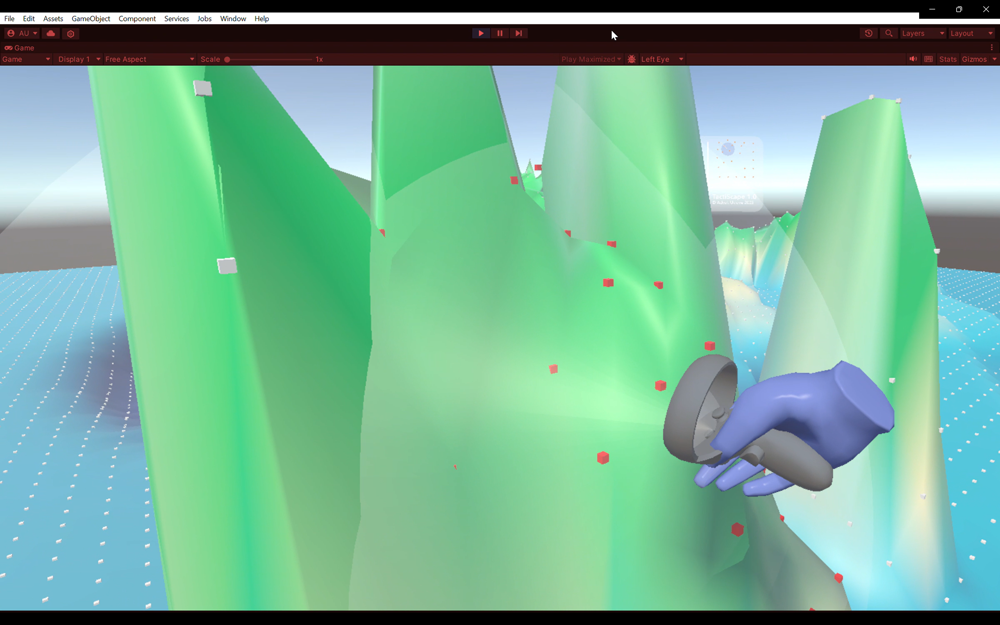
 First Success! - Vertices get displaced very quickly    

> I was happy to realise all these problems at once because they led me to better design solutions as I thought of ways to fix them. I fixed them as follows:

#### 1. Framerate adjustment

For this purpose, I fell back to a very [elegant technique](https://medium.com/star-gazers/understanding-time-deltatime-6528a8c2b5c80) used in game design everywhere to make up for the difference in performance between machines. Movement in games is usually done per frame i.e., my formula for displacing the vertex is run once every frame. And so running the same formula on machines that are rendering at different frame rates makes it so that the total displacement of a vertex per second is higher on a better computer running higher framerates. The technique involves taking the displacement formula I created for translating the vertices and simply dividing it by the time taken to render two subsequent frames. This ensures that a device working at 30 frames per second and a device working at 120 frames per second both move an object the same amount (eg: 100 cm) over a second since the machines are displacing the object 100/30 = 3.33 cm and 100/120 = 0.83cm per frame respectively.
This also made the performance a whole lot smoother, and vertices started getting displaced in a way that felt more natural.

#### 2. Local Hand Movements

I realised that moving my right hand slightly was causing no impact on the vertices and only significant movement in my position displaced them. As I dug into my code, I realised that although I was moving the vertices relative to my right-hand position, my right hand position was always fixed on a larger scale as it was calculated relative to the player controller's position. I wrote functions that then calculated hand position more carefully and that led to the smallest movements in my right hand making for displacement. I of course had to make sure normal hand shaking wouldn't cause undesired movement and so I calculated a margin in hand movement from 0 up till which the readings are not called into effect.

#### 3. Solving for Feathering

Finally, I realised that since every vertex was referring to the same formula and there wasn't a huge difference in direction from every vertex to the hand, all of them appeared to be displacing the same extent the same way. This was not consistent with how movements typically occur in the physical world. When I apply force onto clay, it is distributed with the clay nearest to my hands and in the direction of my motion feeling the largest amount of pressure. So I adjusted the formula accordingly making the displacement inversely proportional to the distance between the right hand and every individual vertex. This created a feather effect as seen in Blender for example.

#### I don't want the whole thing to move! - Defining brush shapes!

Another less immediate problem was that my displacement formula involved no complex mathematics for which vertices are selected for operation. It 'selected' all the vertices that were within a preset range from the right-hand which lead to a lot of accidental and unintended manipulations (for example, of vertices behind the hand translating towards it when the hand is trying to push vertices in front of it away from it. At this stage I decided to make a few new 'brush shapes' The design for these is in the paper, but the gist is that creating these brushes included some calculations in addition to the proximity check including looking at a vertex’s y-position w.r.t. the hand and looking at the hand's forward vector to analyse whether it was pointing exactly towards, generally towards, or away from every single vertex in its proximity.
Using these techniques, I created the hemispherical and the spherical cone brushes in different directions for more precise manipulations.

> [View the paper for details of the working](https://github.com/AdvaitU/tactiscape-vr/blob/main/AdvaitUkidve-TactiScapeVR-ThesisThesis.pdf)

#### Something's off with the scale!

Another thing that I quickly realised was that although visualising the landscape I was working on at scale was great and helped me contextualise the world, it made it extremely tedious to actually manipulate it. So, I created a system where a user is permitted to scale the landscape up and down in order to conveniently work on it and/or conveniently and better visualise it.

### October 11 - October 20

#### But what are all the ways in which I can deform the mesh? - Designing brushes

The next problem was the displacement of the vertices itself. I had managed to displace them away from the hand, radially outwards, but this only mimics the very basic functionality of pushing a ball shaped fist into clay and nothing else. There are other ways to manipulate clay through a push, far more important ones. Besides, the virtuality of my clay in the software allowed me to pull it towards myself as well and I figured that would add immense versatility to the process.  
I decided to create different ways of 'impact' - different behaviours associated with the displacement of vertices that will allow one finer control of the sculpting process.

I created the following brushes:

1. **Pinch** - This replicates the act of pinching clay to create a peak. For the purpose, the brush simply changes the direction of the translation from the original, pulling vertices to itself radially.
2. **Free Form Brush** - This is really the core functionality of the brush. This brush translates the vertices in the direction of the movement of the hand. For this, I calculate the deviation in position of the hand from one frame to another, calculate a direction based on it, and translate all the selected vertices in that direction.
3. **Free Form Up and Down** - The free form brush was great, but it created massive problems of vertices being pushed to close to each other and the smallest of translations in the hand in x and z axes resulting in movement. What I also needed was a structure to only translate them in the y axis to replicate patting down on clay. I created this by measuring only the y axis displacement of the right hand and multiplying it with the previously created displacement formula.    

>[View the paper for details of the working](https://github.com/AdvaitU/tactiscape-vr/blob/main/AdvaitUkidve-TactiScapeVR-ThesisThesis.pdf)

#### How do I show the area of influence?
Next, in order to show the area of influence to the user, there had to be visual feedback. I decided to create small cubes/spheres at the location of every vertex and shade them white. When the hand was in proximity and the brush shape 'selected' a vertex, it would turn red indicating to the user that it can now be manipulated. Furthermore, I created 3D models of all the brush shapes and attached them to the right-hand controller in unity as children. Depending on the brush selected, a switch statement would run first disabling all the models from the scene and only enabling them when the particular brush shape is selected. I also tied them to the brush radius value using it to scale them up and down as necessary when the user changes the radius of the brush influence.

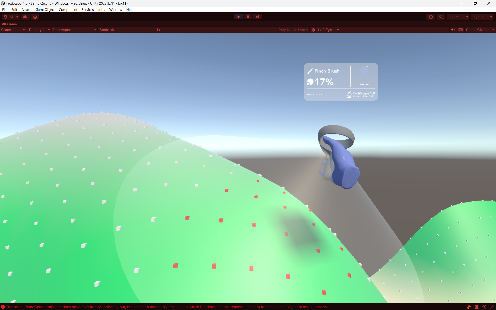
 Screenshot showing the area of influence with red cubes and translucent brush shaped 3D Models 

#### Looks good, but what if someone wants to take it to Blender next - The export system
Eventually, as I kept creating landscapes using my tool, I realised there was so much functionality I wanted in it that I expected from a CAD application - the kind of functionality that would take me a lot beyond the time afforded by this project to develop (Ignoring completely my lack of expertise and experience in creating computer graphics). So, I decided to create a simple export system that would allow me to export the model at run time at any point as a compatible file and then import it into another software like Blender or Fusion 360 later in order to perform finer operations, texturing, rendering, etc. I used the Autodesk FBX package for Unity and plugged it into my scripts. This package exports the entire scene as an FBX file reproducible in most CAD software. 

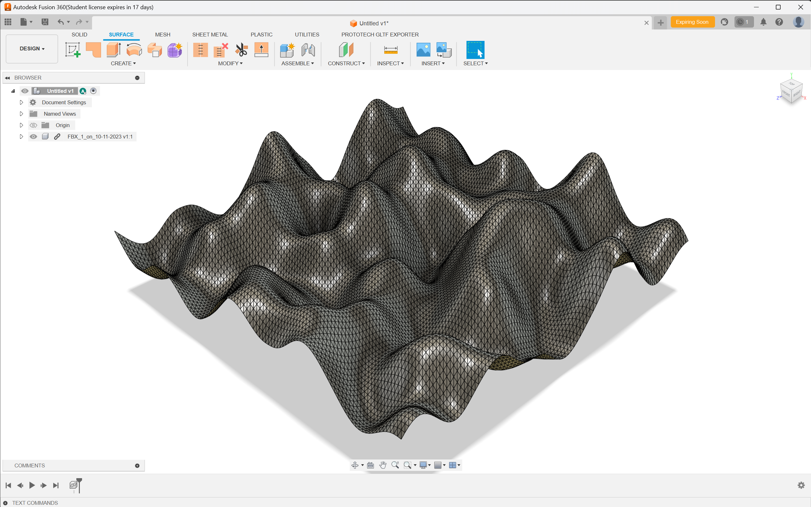    
 FBX Exported and opened in FUsion 360 

#### And what if they just want to visualise it? - PNG Exports
I'd also discovered the lovely concept of depth maps in my chats with Lieven and I decided to let the user export the terrains they created as depth maps additionally - this would allow for easy visualisation of the terrain at quick glance the same way architects look at contour maps and also an easier method to import models into my tool. In order to achieve this, I wrote an Exporter script that inherits the vertex information from the Mesh Generator script. Then, it uses the x and z position of a vertex to correspond to a pixel on a 2D PNG canvas in row x and column z, and the y value to shade the pixel in greyscale normalised between the minimum and maximum y of the mesh. Additionally, I also used the gradient I'd created for the vertex shader to shade the pixels to create depth maps that are arguably less functional but more colourful and easier to visualise by glancing at.

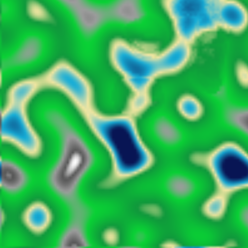   
 PNG Depth Map with Gradient 

### October 21 - October 31

#### The brushes still don't seem natural
All the while, as I was rapidly adding functionality, one thing was missing. The brushes still didn't seem natural as hard and soft pushes would displace the vertices an equal distance per frame. I found the answer in the XR Interaction Toolkit documentation online - I could read the velocity of the controller. This velocity was presented as a 3D vector with x, y, and z values corresponding to its velocity (movement/frame) in each cartesian axis. I used this velocity as a multiplier to the original formula and it worked!

#### Also, visuals are not the only important thing - Haptics and Sound Design
In addition, to truly tie into the tactility hypothesis, I realise simply visual feedback wasn't enough. I added haptic and sound feedback which was triggered in two different modes - simply touching and stroking the landscape to feel the friction off the material and active manipulation of the landscape. The simple feeling was calculated with a proximity check with the surface along with a check to see if the hand had any velocity parallel to the surface it was near (accounting for a small margin for natural handshake). The haptic feedback for active manipulation was built directly proportional to the velocity of the hand so it would be felt more with a harder push and less with a softer one.

#### Solving performance issues - 25 fps to 65 fps
The tool was working quite well but at an unfortunate 25 fps now. I decided to sit and break down the code (without, hopefully, breaking it altogether) with Lieven who helped me see a lot of amateur mistakes I'd made with how it was designed.    
Instead of the Mesh Interactor copying all the values, editing them, and pasting it back into the Mesh Generator, I started passing all the values by reference. I extended this technique to all the function that were showing up as expensive in Unity's inbuilt analyser. I also made strong choices to remove the Update() function that Unity runs from all but the Mesh Interactor script. Instead, the mesh interactor updates functions from other script only when a relevant change is made. For example, earlier I was updating the size of the 3D Models showing the area of influence through the Update() function in its script at every frame. But since the brush size changing is a less frequent occurrence in the larger scheme of things, I made methods that changed the size to match the brush size and only called them through the Mesh Interactor script when the user pressed on the button that changes the brush size (and not on every frame).    
These changes made a huge difference as the framerate of the tool went up from 25fps to 65 fps, more than doubling, with no real change in how it functions.

#### I need to write all of this down lest I forget myself - Documenting the code and writing the paper
With the tool complete and testing scheduled for early next month, I took the opportunity to document all the code with comments and wrote and re-edited large parts of the paper.

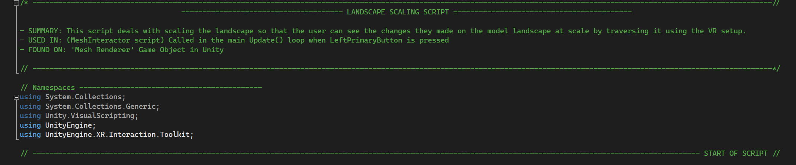
 Headers at the top of every script describe its function  

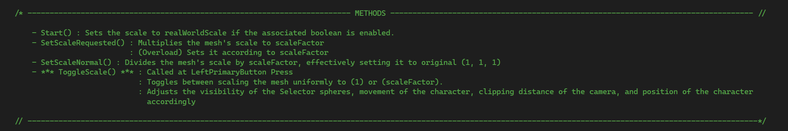
 Methods documented in comments 

## November

### November 01 - November 15

#### Let's take a step back - What am I testing towards?
Next, I had gone back to my notes from September regarding what I was testing towards and made a simple structure of information I wanted to find out. I then ran it by Phoenix who had some excellent suggestions to ask questions to make the participants critically examine their experience.  Here's the testing framework:

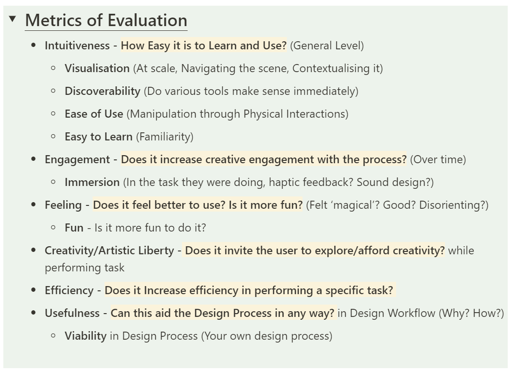
 Metrics of Evaluation 

#### Building the experiment and testing:
I decided to conduct my testing experiment in 3 parts: Let the users use landscape manipulation in Blender, then in the research tool, and then ask them questions that make them critically reflect on their experience. At the end, participants were asked to fill in a questionnaire rating their experience along multiple metrics in Both Blender and TactiScape from 1-10. Here are a few images from testing:

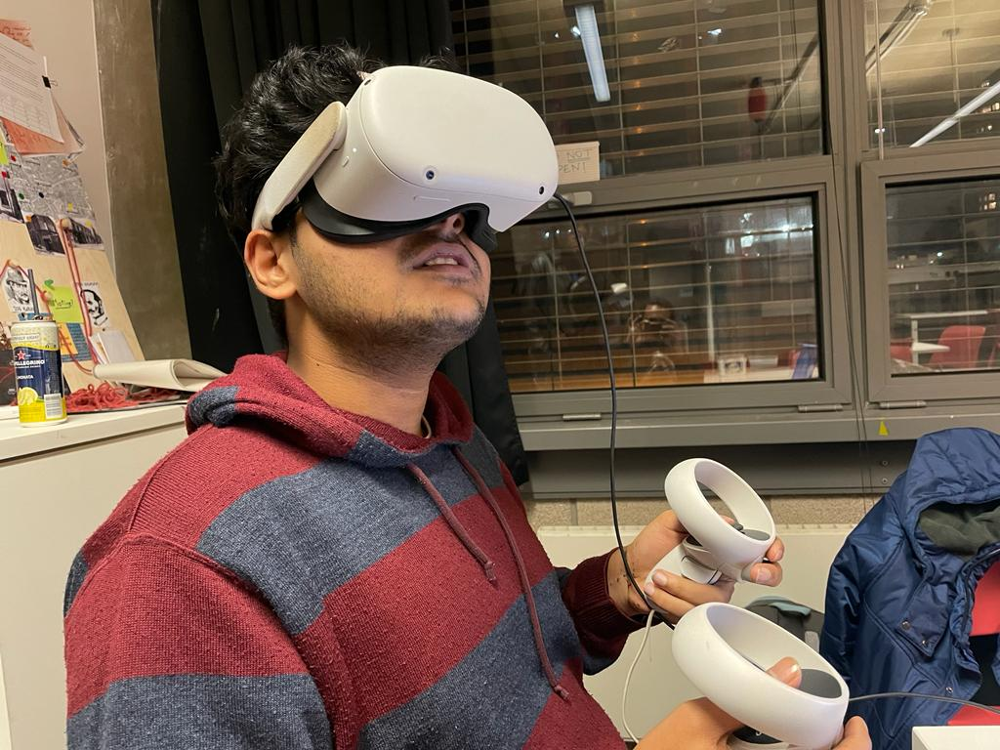 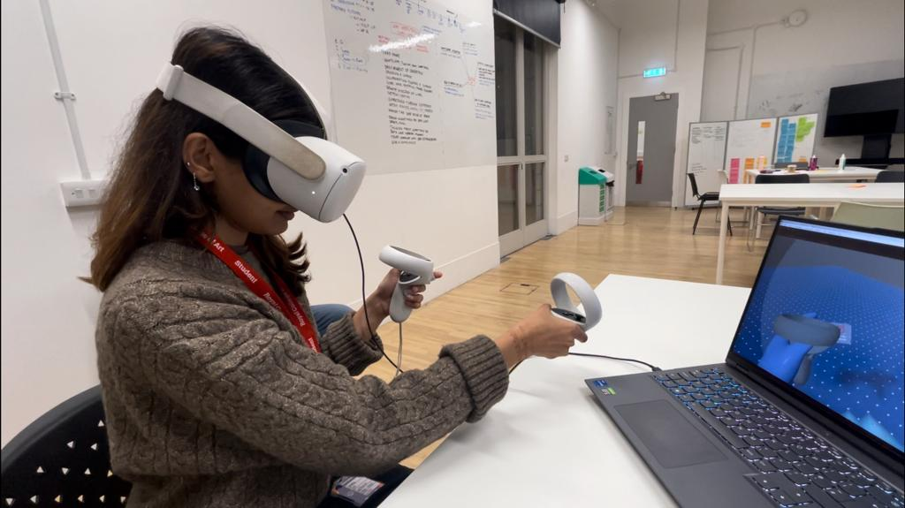 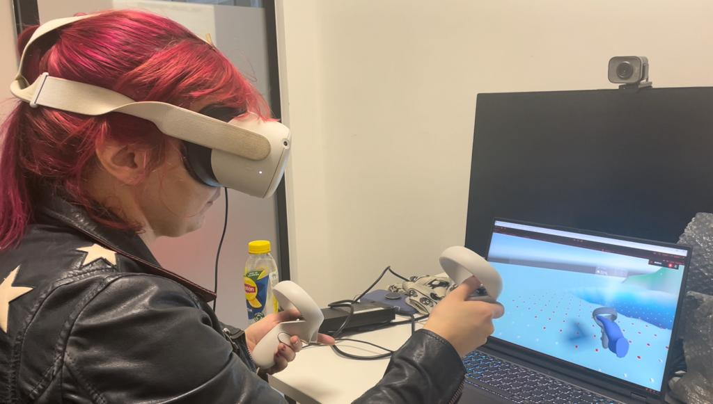
 Images from testing 

### November 16 - November 24

#### Analysing the results from the testing
I sat down and analysed the results from the experiment and made clean graphs to present. These are recorded in this video presentation in brief and in the [Research Paper](https://github.com/AdvaitU/tactiscape-vr/blob/main/AdvaitUkidve-TactiScapeVR-ThesisThesis.pdf) in detail.

#### Making a video to show it off
Probably the toughest part of the entire thesis was presenting my work, especially in video format. But I (kinda) pulled it off after very minimal amounts of 'set design' and large amounts of practice saying what I wanted to say. You can view the video [here](https://www.youtube.com/watch?v=_FOe3XUQhgI).

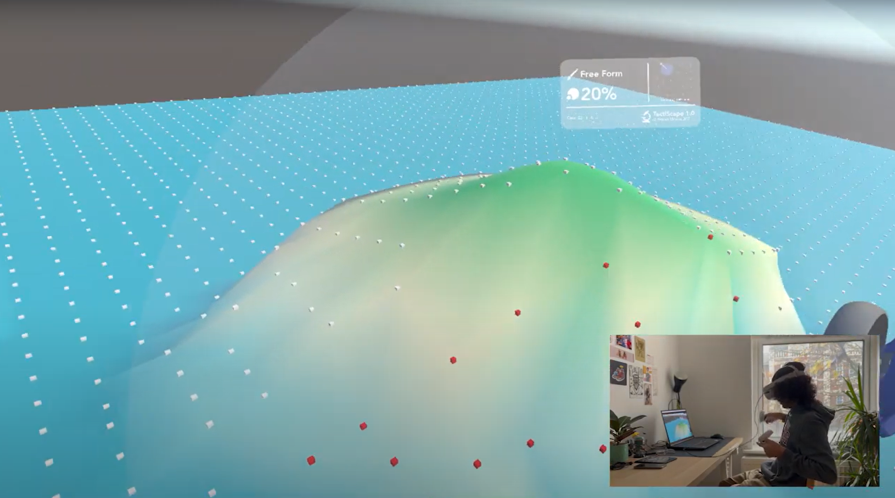
 Screengrab from the video 

> Thanks :))

